 

  

  

*Data Analytics Apprentice @ Google · Ex Martech Analyst · Ex Computer Vision Engineer*

---

## `whoami` — About Me

I'm an AI & ML engineer and data analyst interested in building intelligent systems that solve real-world problems.

I enjoy working at the intersection of **data, artificial intelligence, computer vision, and robotics** — turning complex ideas into practical applications.

- Currently working as a **Data Analytics Apprentice at Google**
- Experienced in data analytics, martech, and computer vision
- Building interactive applications and intelligent data systems
- Exploring agentic AI, generative AI, and ML infrastructure
- Interested in robotics, space technology, and deep-tech research

> My goal is to build systems that connect intelligence with impact.

---

## `./current_focus`

<table>
<tr>
<td width="50%">

### Data & Intelligence

Advanced analytics, business intelligence, intelligent data systems, and data-driven decision-making.

</td>
<td width="50%">

### Agentic & Generative AI

AI-powered applications, intelligent agents, LLM workflows, and automation.

</td>
</tr>
<tr>
<td width="50%">

### Computer Vision & Robotics

Perception models, visual understanding, and AI systems for real-world environments.

</td>
<td width="50%">

### Scalable ML Systems

MLOps, cloud infrastructure, model deployment, and production-ready AI applications.

</td>
</tr>
</table>

---

## `tech_stack`

### Languages

  

### AI, ML & Computer Vision

  

### Backend, Data & Cloud

  

### Tools & Infrastructure

  

<b>More technologies and areas of interest</b>

 

`SQL` · `HTML` · `CSS` · `NLP` · `Generative AI` · `MLOps` · `OCR` · `EEG Signal Processing` · `Brain-Computer Interfaces` · `Data Visualization` · `Robotics`

---

## `featured_projects`

### 01 — WikiCrawl

**Explore Wikipedia as an interactive knowledge graph.**

WikiCrawl transforms the links around a Wikipedia article into an interactive graph. Search for a topic, watch the crawl unfold, and explore the resulting connections.

- Interactive graph exploration
- Visual representation of article relationships
- Live web application

  
  

### 02 — Tesseract

**AI-powered legal document processing.**

A legal document application combining OCR and language models to help summarize and translate documents across multiple languages.

- Document text extraction with OCR
- AI-powered summarization
- Multilingual translation

  

### 03 — Contagious Tech

**Computer vision for human target detection and acquisition.**

An object-detection project exploring deep learning-based visual detection.

`YOLO` · `Python` · `Computer Vision`

### 04 — Brain-Computer Interface Research

**Exploring the intersection of neuroscience and computing.**

EEG signal processing and brain-computer interface experiments involving interactive applications and game-play analysis.

`Python` · `OpenBCI` · `BrainFlow` · `Signal Processing`

---

## `achievements_and_leadership`

### Certifications

- Google Data Analytics Professional Certificate
- Google Advanced Data Analytics Professional Certificate
- Google Prompt Engineering and AI-related certifications
- Python for Data Science — Harvard University (edX)
- Data Science: Inference and Modeling — Harvard University (edX)
- Cisco networking certifications and coursework:
  - Introduction to Networks
  - Switching, Routing, and Wireless Essentials
  - Enterprise Networking, Security, and Automation

### Awards & Recognition

- **Winner — Smart India Hackathon 2023**, Software Edition
- **Best Paper Award** — Neural Signatures in EEG Analysis
- **Spot Award** — Exceptional Performance as Consultant & Data Analyst at Tatvic

### Leadership

- **Lead — Google Developer Student Clubs (GDSC)**, IIST Indore
- **Lead — CodeChef Chapter**
- Community building, technical events, and developer outreach

---

## `github_stats`

<!-- These SVGs are generated and committed by GitHub Actions. -->

---

## `beyond_the_terminal`

When I'm not working with data or building AI applications, I'm usually exploring:

- Space technology and aerospace
- Robotics and autonomous systems
- New developments in AI research
- Open-source software and developer tools

---

## `connect`

Have an interesting project, research idea, or opportunity? Let's connect.

  

**Building systems that connect intelligence with impact.**

